# Flutter Bus Reservation App with Spring Boot API

This project is a **Flutter** mobile application that integrates with a **Spring Boot** backend API to provide a complete bus reservation system. The backend handles the logic for managing buses, routes, reservations, and more, while the Flutter app serves as the frontend for both **Admin** and **User** functionalities.

---

## Table of Contents

- [Description](#description)
- [Features](#features)
- [Screenshots](#screenshots)
- [Key Libraries](#key-libraries)
- [Contributing](#contributing)

---

## Description

This app allows users to search for available buses, make reservations, and manage their bookings. Admins have additional privileges to manage cities, buses, routes, and schedules. The app is powered by a **Spring Boot** backend that provides RESTful APIs for all operations, including user authentication, bus management, and reservation tracking.

---

## Features

### Admin Features:
- **Add/Update/Delete Cities**: Admins can manage cities to define bus routes.
- **Add/Update/Delete Buses**: Admins can manage the available buses for
  routes and schedules.
- **Add/Update/Delete Routes**: Admins can define routes connecting cities and manage route information.
- **View Reservations**: Admins can view all reservations made by users.
- **Add Schedules**: Admins can schedule buses for different routes and timings.

### User Features:
- **Search Buses**: Users can search for available buses based on source, destination, and date.
- **Book a Bus**: Users can reserve seats on buses for a selected route and schedule.
- **View Profile**: Users can view and update their profile details.
- **My Reservations**: Users can view their past and upcoming reservations and booking history.

---

## Screenshots

Include key screenshots of the app’s UI here, such as the following examples:

| Admin Login                                                                | User sign up                                                               |
|----------------------------------------------------------------------------|----------------------------------------------------------------------------|
| 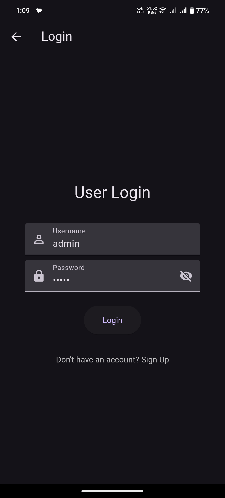 | 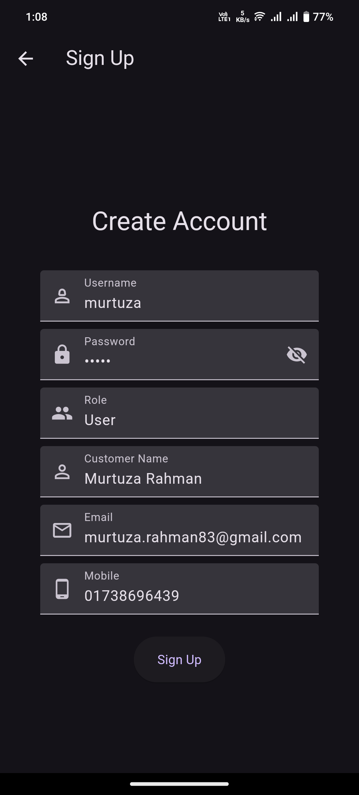 |

| Admin Drawer                                                               | User drawer menu                                                           |
|----------------------------------------------------------------------------|----------------------------------------------------------------------------|
| 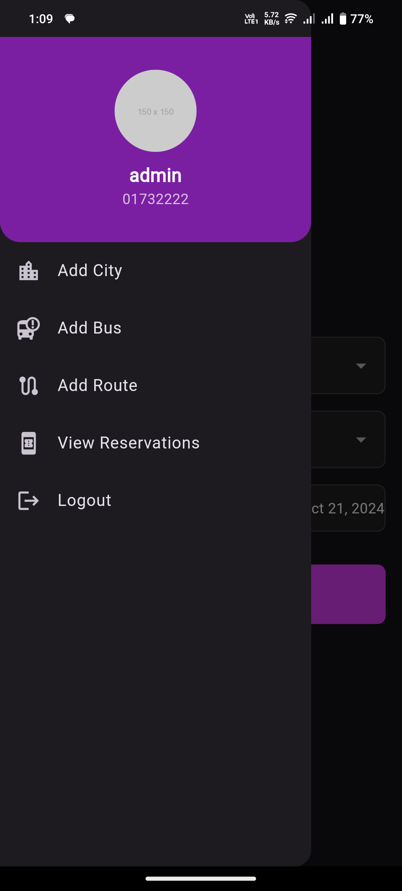 | 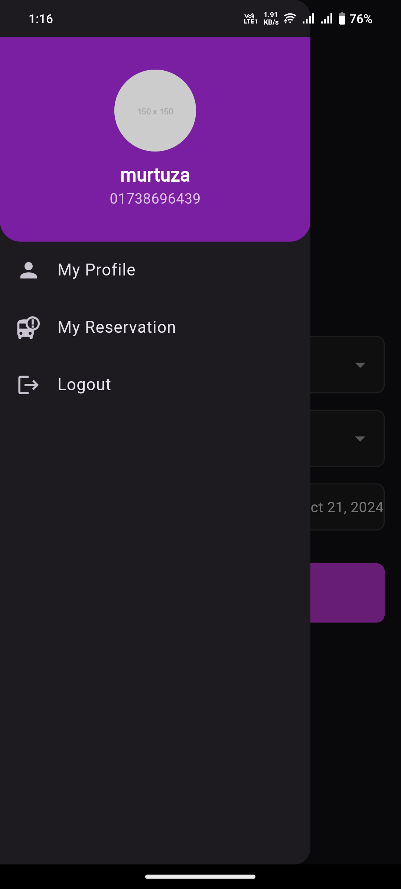 |

| Admin add bus                                                               | User Bus Search |
|-----------------------------------------------------------------------------| --------------- |
| 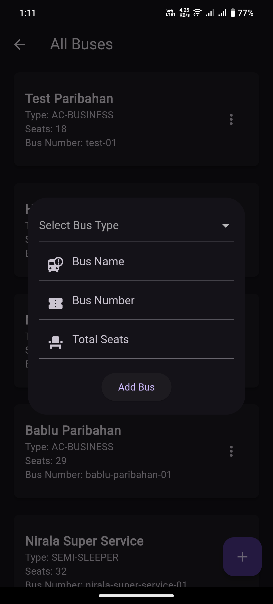 | 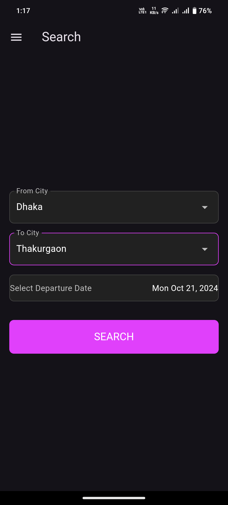 |

| Admin add city                                                         | User search result                                                         |
|------------------------------------------------------------------------|----------------------------------------------------------------------------|
| 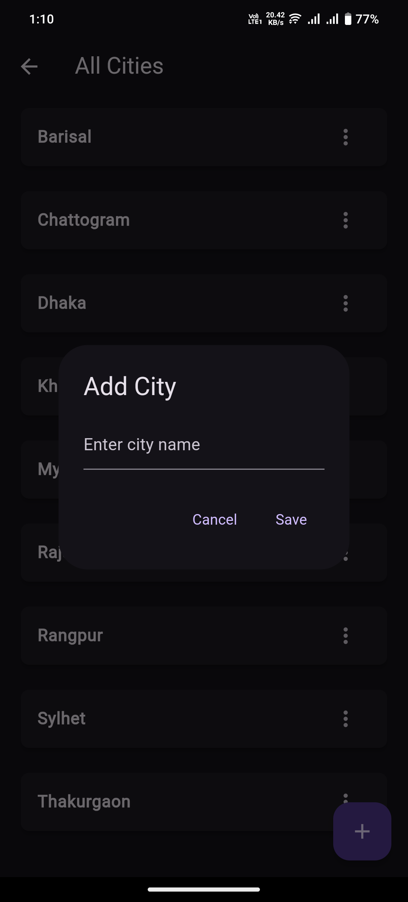 | 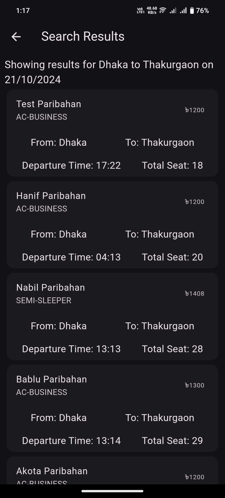 |

| Admin add schedule                                                          | User seat plan                                                             |
|-----------------------------------------------------------------------------|----------------------------------------------------------------------------|
| 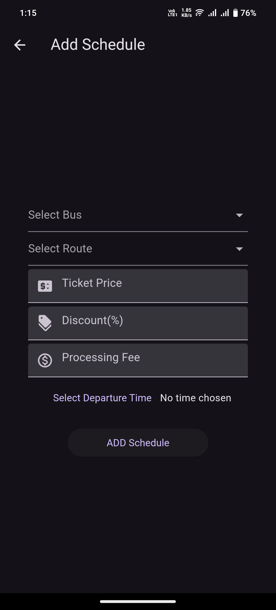 | 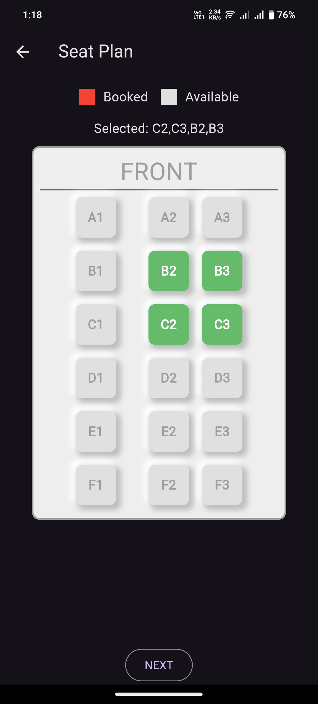 |

| Admin reservation list                                                                | User seat plan                                                                  |
|---------------------------------------------------------------------------------------|---------------------------------------------------------------------------------|
| 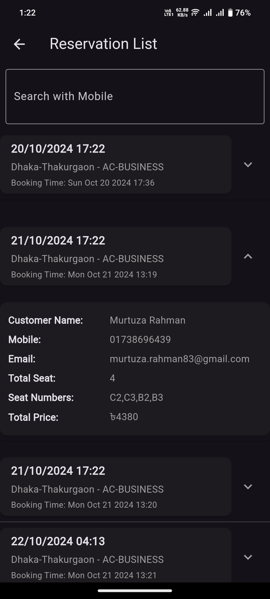 | 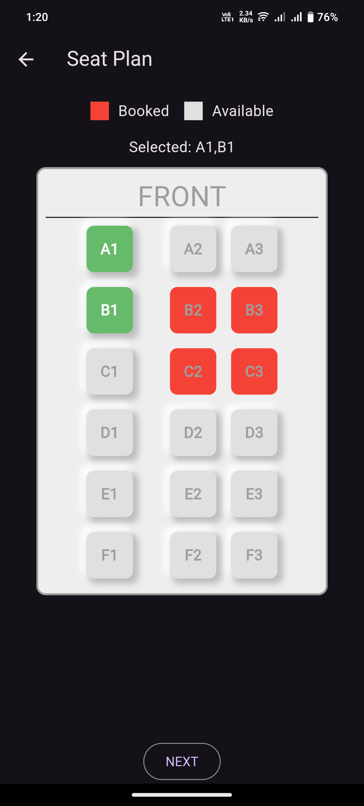 |

| Admin all schedule                                                          | User booking confirm                                                       |
|-----------------------------------------------------------------------------|----------------------------------------------------------------------------|
| 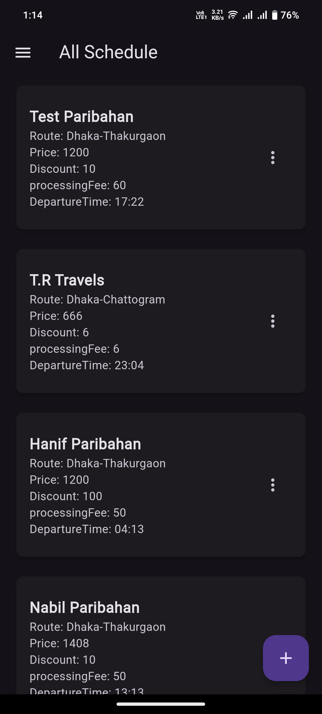 | 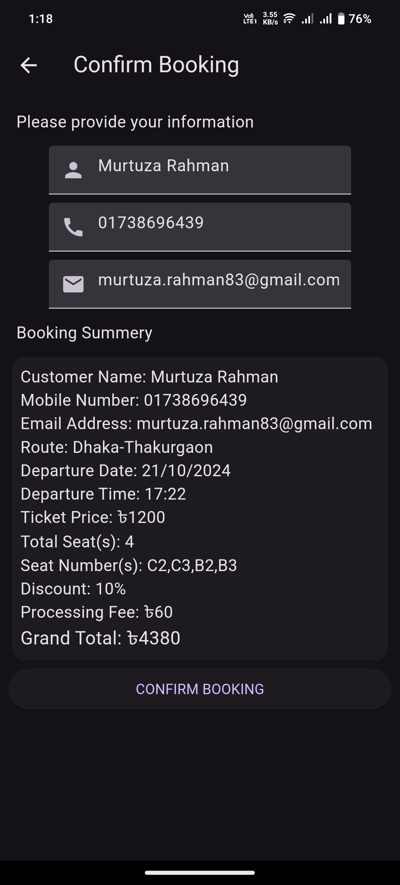 |

---

## Key Libraries

Here are the core libraries used in the Flutter project to build the frontend and interact with the Spring Boot API:

### Dependencies:
- **http**: Used to make HTTP requests to the Spring Boot API and interact with backend services.
- **provider**: A state management solution used to manage the app's state across different parts of the application.
- **shared_preferences**: This library is used to store persistent data locally, like user login sessions.
- **freezed_annotation** and **json_annotation**: These libraries are used to generate immutable classes and to handle JSON serialization and deserialization between the app and the API.
- **flutter_easyloading**: A utility for showing loading indicators during long-running operations such as API calls.
- **go_router**: Used for managing navigation and routing within the app.
- **cached_network_image**: Efficiently loads images from the network and caches them locally to optimize performance and reduce bandwidth.

---

#### Backend (Spring Boot API)

Clone the backend repository:

[https://github.com/Developer199239/spring-boot-bus-reservation-api.git](https://github.com/Developer199239/spring-boot-bus-reservation-api.git)

## Contributing

We welcome contributions from developers who want to improve the project! To contribute:

1. Fork the repository.
2. Create a feature branch: `git checkout -b feature-name`.
3. Make your changes and commit them: `git commit -m 'Added feature-name'`.
4. Push to the branch: `git push origin feature-name`.
5. Open a Pull Request.   
  
